# Working CNN
2 February 2017

The prediction layer of the CNN looks very promising. Before the softmax, you can see that the prediction is most confident at the target (the next point), but it is also somewhat confident along the entire line towards the answer. Hopefully I can come up with a cost function or softmax layer that does not punish this behaviour!

One concern I have is that the training set is too large and may represent a significant fraction of the input space, such that overfitting on the training set still results on good performance on the held out validation set. I will have to increase the image size (currently 32x32) and complexity (pixels are 0 or 1 right now, monochrome, convex shapes only) to find out if this is true.

I also went ahead and added a little bit of noise (4% random pixels) to the images. I will introduce more complex polygons later.

# First end-to-end system integration
4 February 2017

If the network picks a point within 2 pixels (6% of the image) of the starting point, the shape is automatically closed. This only works about 90% of the time and gives an IOU in the 60-70% (70-80% without noise) range.

### Observations
The neural net actually is better at finding corners than ordering corners (unsurprisingly). See perfect_iou.png.

This means that sometimes it skips a corner and cuts off a chunk of the shape. See shallow_angle.png or skip_corner.png attached.

Sometimes the network forgets the direction it is traversing the shape and goes backwards. This is probably related, but usually causes bigger issues. See wrong_direction.png.

The higher scores (> 80 IOU) will trend higher with higher resolution images, because of aliasing occuring along edges.

In the long term, it is probably worth investigating if I can use a separate output neuron (share most of the network except the output layers) to indicate the end of the polygon.

IOU for valid shapes only is ~80% even on noised and blurred dataset.

# History mask
Experiments with zeroing out the history mask show the history mask is unused
   - will need to visualize the weights to confirm
   - try some sort of regularization to prevent this?
   
## Meeting notes
8 February 2017
- Try two points as history mask
- Show training set IOU and validation set IOU together
- Try reducing vertices with angles ~180 degrees
- Distance Transform

# History experimentation
On validation set of 1000 images
line-mask:
IOU = 0.8049418066159604, failed = 129

line mask, zeroed:
IOU = 0.791100085984716, failed = 237

Line history (fixed):
IOU = 0.8478980740994885, failed = 72

Line history (fixed, zeroed):
IOU = 0.8266719020871185, failed = 145

No history mask:
IOU = 0.8406220083067095, failed = 194

Point history:
IOU = 0.8219838139802708, failed = 139

Point history (zeroed):
IOU = 0.832699836324291, failed = 208

__Conclusion:__ the history mask does help reduce failures to close the shape. The line history mask is much better than the point history mask for this purpose.

- Errors where the network appears to go in the wrong direction are because a single pixel is higher than the next point
- Try spatial softmax? - convolution layers
    - Add a "valid moves" mask? multiply it in as a fixed constant near the last layer?

# Validity mask

- ~~Try using a mask that indicates which points are valid outputs.~~

Validity mask (line history, fixed):
IOU = 0.760096910805428, failed = 118

Results for the validity mask are inconclusive. Need to refine the validity mask implementation with some sort of ray tracing algorithm. TODO

## Meeting notes
- Smooth the ground truth with soft crossentropy
- ~~Use an RNN~~
- Try providing the point required to close the shape as an input

# Recurrent Neural Network
## Working RNN
- Working CNN + RNN implementation; cross entropy is decreasing over at least 10k steps, but accuracy doesn't seem to be getting better

### TODO
~~- Add the image summaries back in~~
~~- Add validation set measurements to rnn.py to see if it's working?~~
~~- "Upgrade" to multi-layer LSTM~~
~~- Run overnight~~
~~- Run on server~~

# 1 March 2017
- CNN + RNN
- Overnight run on server shows improvement in validation loss and error after ~5000 iterations
- Minimum of ~1.5 pixels mean validation error
- Pictures still show that the network is unsure which point is next to pick, but it no longer goes backwards and re-picks already chosen points

### TODO
~~- Debug accuracy measurement~~
Probably just a Python 2 problem; use `from __future__ import division` as temporary fix?
~~- Program IOU for RNN~~
95%+ training iou and approximately 75% validation IOU
- Check failure rate
- Investigate durations for d > 3
- Clean up IOU code - use Tensorflow variable sharing to build both the "training network" and "inference network"
- IOU image summaries

# 2 March 2017
- Working policy gradients implementation (on CartPole-v1)
- ~~Investigate why NaNs appear in the optimizer when changing TD-target to TD-error..?~~
Fixed - should just use softmax_cross_entropy_with_logits function which gets rid of singularities in the softmax

# 5 March 2017
- ~~Move the learning into the episode loop~~

# 10 March 2017
- A3C on RandomShapesVertices-v0 goes from ~23% to ~28% IOU over 10 hours
- Too slow, consider pretraining
- Very high entropy still, what's the random baseline?
- CNN can achieve down to 2% failure rate with ~80-85% IOU with new architecture/optimizer
~~- Advanced optimizers seem to be less stable?~~
    - Use smaller learning rate
    - ~~Need to achieve 90%+ on simple polygons~~

# 13 March 2017
- ~~Talk to Tingwu~~
- Install Universe/Docker
- ~~Get CNN running on the cluster~~
    - ~~Need to bring your own Python install?~~ Yes

# 15 March 2017
- Reinforcement learning (A3C) https://arxiv.org/pdf/1602.01783.pdf
    - ~~Debug the A3C algorithm. It seems to peak in performance much lower than the paper reported~~ Use the [Universe starter agent](https://github.com/openai/universe-starter-agent)
    - 70% IOU* after 3 hours of training (4 threads) with the default network (4 conv layers of 32 filters + 256 cell LSTM)
    - \* Dataset is different
    
# 16 March 2017
- ~~Clean up the universe install~~
- ~~Debug issue with RandomShapesVertices lines (extra lines?!)~~
- ~~Test on Luis' dataset~~

# 17 March 2017
- ~80% IOU using squared reward (A3C)
- ~~Generate a eligibility trace-like image~~

---

# Summary
Using 32x32 images. Data is randomly generated at runtime.

## Methodology
Pick (10) points at random. Draw a convex hull around them. This is ground truth (and image).

Input data is image, history (lines previously drawn), and cursor (previous point chosen).
For both methods, the shape is closed when the line segment crosses any previous line segment or after 10 time steps.

For supervised learning formulation, the next vertex is provided at every time step. Random batches across a training set of 9000 images are provided. Validation is performed on a smaller set (1000 images).

For RL formulation, images are randomly generated at runtime. First step allows any point to be chosen. This places the cursor. Subsequent steps draw a line segment from the cursor to the point chosen, then move the cursor. Reward is IOU at end of episode.

## Results
**Baseline (Use one optimal rectangle always): 61% IOU**

**Supervised (CNN): 80-85% IOU**

Model: conv(16 5x5 filters) -> 2x conv(32 3x3 filters) -> fc

2% of shapes fail to close within 10 time steps. Other shapes close, but have no area.

In the following pictures, red is ground truth, green is estimate, and blue is cursor. Of course, everything overlaps so things come out in multiple colours...

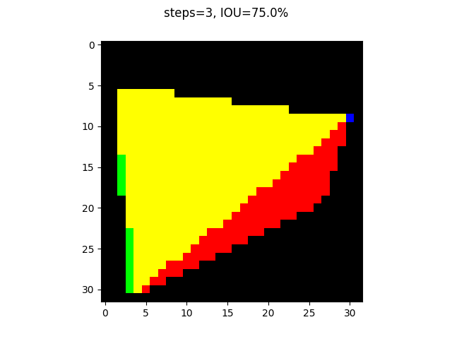
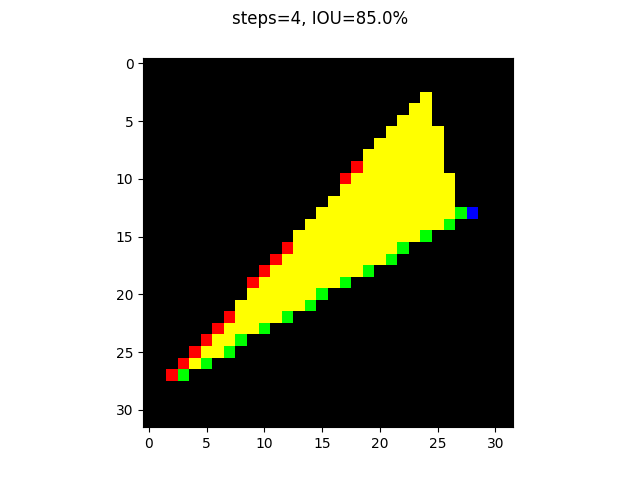
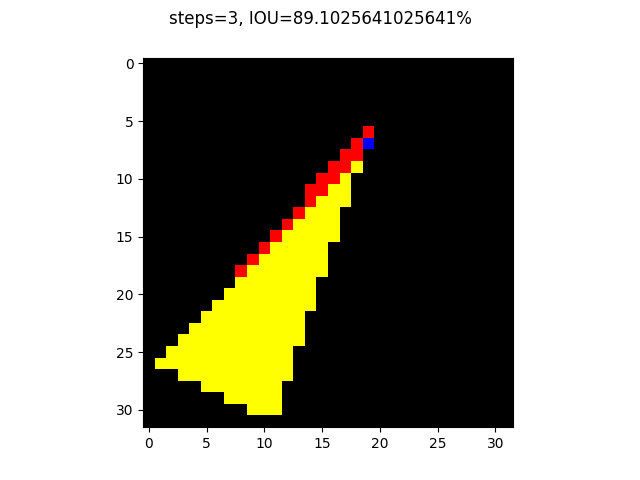
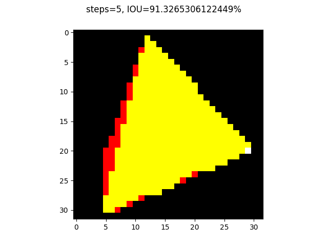

This next shape is closed, but results in a shape of area 0.

Some weirdness resulting from picking awkward points.

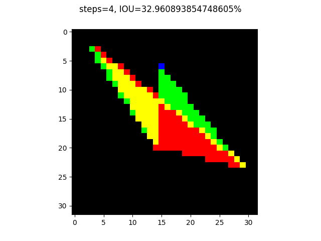

The following shape is concerning because it looks like the network is "memorizing" more than it is learning about shapes...

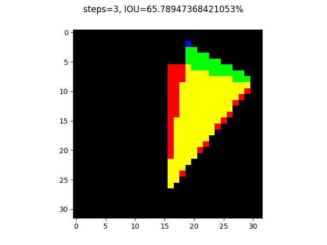

- I also tried using just the previous points as history (rather than line segments). This mainly seemed to make bad cases worse, as shapes had trouble closing

**Supervised (LSTM)**

No existing runs.

**A3C (CNN): 60% IOU**

Model: conv(16 5x5 filters) -> conv(32 3x3 filters) -> conv(32 3x3 filters) -> FC

Never gets past forming simple squares that basically take up the whole image. I would say this is identical to the baseline.

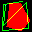
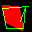
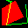
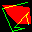
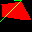

**A3C (LSTM): 80% IOU**

Policy Model: 4x conv(32 3x3 filters with stride 2) -> LSTM(256 cells) -> FC

Value Model: Shared with policy except last layer

Does this work better because it actually learns something about the shapes, or is it just because it has more parameters so it can memorize more shapes?

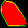
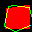
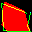
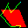
- Also tried squaring the reward to encourage 

**Using 128x128 images:**

**A3C(LSTM)**

---

# 23 March 2017
- ~~Figure out if scipy is drawing just the interior of the shape and if we need to compensate by adding the outline to `create_shape_mask()`~~
- ~~Saving~~

# 30 March 2017
- ~Try LSTM supervised learning~
- What kind of architecture do we use? 2 FC layers at the end is impossibly huge
    - 224**4 parameters!
    - Try architecture inspired by [FCN](https://people.eecs.berkeley.edu/~jonlong/long_shelhamer_fcn.pdf)
    - Should just downsample...

# 2 April 2017
- ConvLSTM integrated from https://github.com/carlthome/tensorflow-convlstm-cell/blob/master/cell.py
    - Training is 7x faster!
    - 93% IOU and 0 failed shapes on the mini synthetic set!!

# 4 April 2017
- Training on Lluis' dataset on the cluster
    - Seems to try to predict all points at every time step to minimize loss
    

# 6 April 2017
- convLSTM seems to predict points in any order
    - First point is unknown - it can't see the cursor?
    - Adding the first point to history map alleviates this problem
    - No sense of directionality..?
    - Good news is that it doesn't predict any single point more than once...

---

### Papers
#### Image Segmentation
- [Fully Convolutional Networks](https://people.eecs.berkeley.edu/~jonlong/long_shelhamer_fcn.pdf)
- [SegNet: Encoder-Decoder Architecture](https://arxiv.org/pdf/1511.00561.pdf)
#### Reinforcement Learning
- [Asynchronous Methods for Deep RL](https://arxiv.org/pdf/1602.01783.pdf)
- [Generalized Advantage Estimation](https://arxiv.org/pdf/1506.02438.pdf)

### TODO
- Compare supervised/RL/combined
- Summaries
    - Actions taken
    - better/debugged logits heatmap/overlay?
    - failure cases - maybe do this after training?
- RL
    - Measure how close the first (or nth) point is to the perimeter of the shape by perpendicular distance
    - Pretrain the policy network

- Provide first point
- Remove trace
- Try LSTM with end token
- Pretrained policy
- check ordering of vertices
- increase receptive field
- check without history